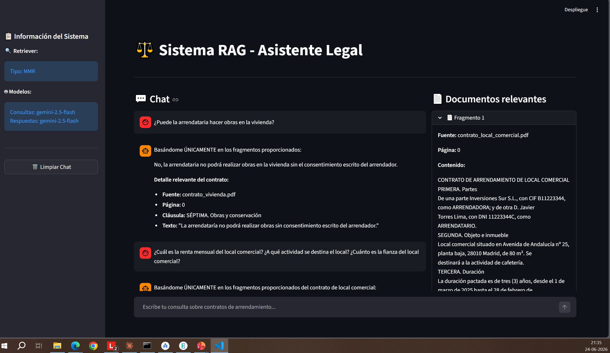

# ⚖️ Asistente Legal RAG

Sistema de **RAG (Retrieval-Augmented Generation)** que responde preguntas sobre contratos
de arrendamiento **basándose únicamente en los documentos cargados**. Construido con LangChain,
Google Gemini y Chroma, con interfaz web en Streamlit.

## 🛠️ Construido con

| Categoría | Tecnología |
|---|---|
| **Lenguaje** | Python 3.13 |
| **Framework IA** | LangChain |
| **LLM (generación + multi-query)** | Google Gemini 2.5 Flash |
| **Embeddings** | `gemini-embedding-001` |
| **Base vectorial** | Chroma (persistente) |
| **Retriever** | MMR + MultiQuery (genera varias reformulaciones de la pregunta) |
| **Frontend** | Streamlit |
| **Gestión de dependencias** | uv |

## 🚀 Cómo levantarlo (fácil)

```bash
# 1. Desde la raíz del repo, instala dependencias
uv sync

# 2. Configura tu API key de Google en un archivo .env (en la raíz del repo)
#    Consíguela gratis en https://aistudio.google.com/
echo "GOOGLE_API_KEY=tu_key_aqui" > .env

# 3. Entra a la carpeta del proyecto
cd "Tema3/asistente_legal_RAG.py"

# 4. Construye el índice vectorial a partir de los PDFs de ./documentos
uv run python ingest.py

# 5. Levanta la app
uv run streamlit run app.py
```

La app se abre en `http://localhost:8501`.

> 💡 ¿Quieres usar tus propios contratos? Copia tus PDFs en `./documentos` y vuelve a ejecutar
> `uv run python ingest.py`. Cierra la app antes de reindexar (la base se bloquea si Streamlit está abierto).

## 💬 Preguntas de ejemplo

- ¿Cuál es la renta mensual del contrato de vivienda?
- ¿Cuánto es la fianza del local comercial?
- ¿Qué pasa si el arrendatario no paga dos mensualidades?
- ¿Se permite subarrendar el local?
- Compara la duración de los dos contratos.

## 🖼️ Captura



## 📁 Estructura

```
asistente_legal_RAG.py/
├── app.py              # Interfaz Streamlit (chat + panel de documentos)
├── rag_system.py       # Cadena RAG: retriever MMR + MultiQuery + Gemini
├── config.py           # Modelos y parámetros del retriever
├── prompt.py           # Plantillas de prompt
├── ingest.py           # Construye/actualiza el índice Chroma desde ./documentos
├── _make_sample_pdfs.py# Genera contratos de ejemplo (datos ficticios)
└── documentos/         # PDFs fuente (contratos de ejemplo incluidos)
```

> El índice `chroma_db/` no se versiona: se regenera con `ingest.py`.
